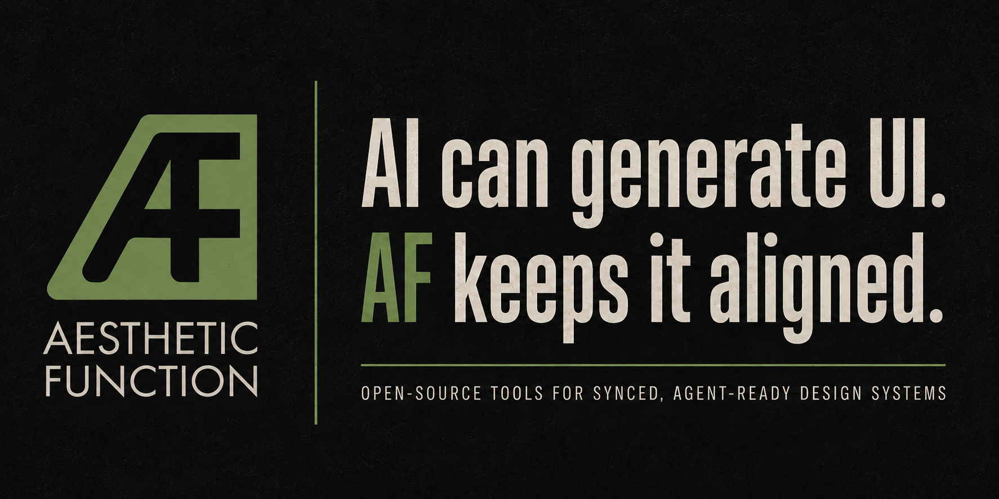

  

<h1 align="left">Aesthetic Function</h1>

Design systems break silently. Tokens drift between Figma and code. Components fall out of sync across frameworks. Documentation lags behind both. AI coding agents generate UI with no awareness of your system's constraints.

Aesthetic Function is a set of open-source tools for keeping design systems honest across surfaces — and making them queryable by AI agents.

## Projects

**[dspack](https://github.com/aestheticfunction/dspack)** — A portable JSON spec for representing design system corpora: tokens, components, patterns, and anti-patterns. Framework-agnostic, AI-readable, human-auditable. Think of it as OpenAPI for design systems.

**[ds-mcp](https://github.com/aestheticfunction/ds-mcp)** — A TypeScript MCP server that loads a dspack file and exposes your design system as tools for AI coding agents. Drop it into any MCP-compatible environment (Claude, Cursor, GitHub Copilot) and your agent gets token lookups, component API references, and pattern guidance without custom prompting.

**[aesthetic-function](https://github.com/aestheticfunction/aesthetic-function)** — A framework-aware control plane for deterministic sync across code, design, and component surfaces. Detects drift between what your Figma file says, what your code implements, and what your documentation claims — then tells you exactly where they disagree.

## How they fit together

`dspack` is the spec. `ds-mcp` is the runtime. `aesthetic-function` is the reconciliation engine.

You can use each independently. dspack files work without ds-mcp (they're just JSON). ds-mcp works without aesthetic-function (point it at any conformant dspack file). aesthetic-function produces dspack as output, closing the loop: your design system's current state, packaged for agents to consume.

## Status

Active development. Contributions and feedback welcome — open an issue in the relevant repo.

## License

Apache 2.0
